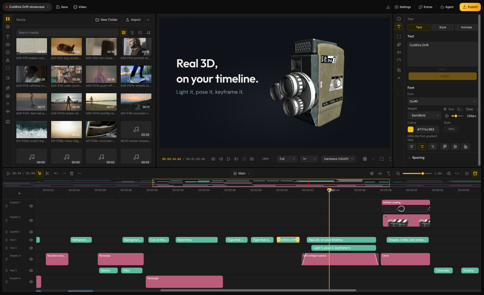

<p align="center">
  
</p>

<h1 align="center">Drift</h1>

<p align="center">
  <strong>「まあこれでいいか」ではなく、プロの仕上がりを実感できる無料のデスクトップ動画エディター。</strong>
</p>

<p align="center">
  <a href="https://github.com/CutWire-Studios/Drift/releases/latest"></a>
  <a href="https://github.com/CutWire-Studios/Drift/releases"></a>
  <a href="https://flathub.org/apps/org.cutwire.Drift"></a>
  <a href="https://discord.gg/J5ANFz6Z3y"></a>
  <a href="../LICENSE"></a>
  
</p>

<p align="center">
  <a href="https://cutwire.org/drift"><strong>cutwire.org/drift</strong></a>
</p>

Drift は CutWire Studios が開発するデスクトップ向け動画編集ソフトウェアです。クリップを配置し、エフェクト、キャプション、ステッカー、
音楽を追加するだけで、洗練された動画を書き出せます — **サブスクリプションなし、ウォーターマークなし、アカウント登録不要**。

YouTube ショートやリール、ゲーム実況の切り抜き、学校の課題、チュートリアル、製品デモ、ミームなど、
ブラウザの制約に縛られたり月額料金を払ったりすることなく、本格的なクオリティを目指すすべてのクリエイターのために作られています。

プレビューで見えている映像がそのまま書き出されます。単一のコンポジター、統一された描画、思い通りの仕上がり。

## ダウンロード

<p align="center">
  <a href="https://flathub.org/apps/org.cutwire.Drift">
    
  </a>
  <a href="https://apps.microsoft.com/detail/9PHHBZ07FRSZ">
    
  </a>
  <a href="../docs/play-testing.md">
    
  </a>
</p>

<p align="center">Google Play はクローズドテスト中 — <a href="../docs/play-testing.md">参加方法はこちら</a>。</p>

**Linux** — Flathub からインストール:

```bash
flatpak install flathub org.cutwire.Drift
flatpak run org.cutwire.Drift
```
**macOS** — Homebrew 経由でインストール:

```bash
brew install --cask cutwire-studios/tap/drift
```

> **macOS での初回起動時:** Drift は ad-hoc 署名されています（Apple による公証は受けていません）。Homebrew 経由でインストールした場合は隔離属性（quarantine）が自動的に解除されます。`.dmg` から手動インストールした場合や Gatekeeper により起動がブロックされる場合は、以下を実行してください:
> ```bash
> xattr -dr com.apple.quarantine /Applications/Drift.app
> ```

または、[最新リリース](https://github.com/CutWire-Studios/Drift/releases/latest) から各プラットフォーム向けのビルドを直接ダウンロードできます:

| プラットフォーム | パッケージ |
|------------------|------------|
| Linux | [Flathub](https://flathub.org/apps/org.cutwire.Drift) · [AppImage](https://github.com/CutWire-Studios/Drift/releases/latest) |
| Windows | [Microsoft Store](https://apps.microsoft.com/detail/9PHHBZ07FRSZ) · [インストーラー (.exe)](https://github.com/CutWire-Studios/Drift/releases/latest) · [ポータブル zip](https://github.com/CutWire-Studios/Drift/releases/latest) |
| macOS | [Homebrew Tap](https://github.com/CutWire-Studios/homebrew-tap) · [ディスクイメージ (.dmg, Apple Silicon)](https://github.com/CutWire-Studios/Drift/releases/latest) |
| Android | [Google Play (クローズドテスト)](../docs/play-testing.md) · [APK (arm64-v8a)](https://github.com/CutWire-Studios/Drift/releases/latest) · [APK (armeabi-v7a)](https://github.com/CutWire-Studios/Drift/releases/latest) · [APK (x86_64)](https://github.com/CutWire-Studios/Drift/releases/latest) |

スマートフォンでは、[Google Play クローズドテスト](../docs/play-testing.md) に参加するか、最新リリースから `Drift-*-arm64-v8a.apk` をダウンロードしてインストールしてください（または `adb install Drift-*-arm64-v8a.apk`）。エミュレーターでは `x86_64` を使用してください。

過去のバージョンや変更履歴の一覧は [全リリース一覧](https://github.com/CutWire-Studios/Drift/releases) をご確認ください。

## スクリーンショット

<p align="center">
  
</p>

## 主な機能

**AI エージェントが直接編集.** 開いているプロジェクト内で、インポート、カット、カラーグレーディング、書き出しをエージェントに指示可能。ウィンドウなしのヘッドレスモードでも実行できます。

**タイムライン上で 3D を操作.** クリップを立体的に傾けたり、照明効果を当てたり、人物の後ろにタイトルを配置できます。3D モデルをドラッグ＆ドロップすれば、同じカット内でそのまま再生されます。

**Lottie アニメーション対応.** モショングラフィックスやベクターアートがどんな拡大率でもシャープに描画されます。色やテキストの差し替えもその場で行えます。

**高度なキーフレーム設定.** 位置、スケール、回転、不透明度、各種エフェクトのパラメータを時系列で柔軟にアニメーション。補間カーブも直感的に調整可能です。

**150 種類以上のトランジションと 40 種類以上のエフェクト.** すべてのスタイルをプレビュー上で直接確認できます。ビートドロップ、グリッチカット、ネオン切り抜きなど、複数のエフェクトスタックをワンクリックで一括適用可能です。

**完全ローカル環境で処理.** 被写体をクリックするだけで瞬時に背景から切り抜き。被写界深度（ボケ味）や専用ライティングをクリップに追加できます。自動字幕起こし、動画の高解像度化（アップスケール）、リアルタイム美顔補正もすべてローカル PC 上で完結します。

**テキストから動画を編集.** 音声がクリップ上でテキスト化されます。不要なフレーズや言い淀み（フィラー）、無音部分を削除し、ベストなテイクを選択して話者ラベルを付与、正確な字幕を生成できます。

**洗練されたデザインタイトル.** カラオケ、Hormozi スタイル、ネオン、クローム、ホログラフィック、手書き風など、33 種類のスタイルパックを搭載。気に入ったスタイルをトラック全体の字幕へ瞬時に反映できます。

**スタック全体を一括操作.** 1 つの変換レイヤーで、下位にあるすべてのトラックを移動、拡大縮小、回転、傾き、フェードさせることができます。グループ化やコンポジット作成にも対応しています。

**音楽のビートに合わせて編集.** タイムラインが自動でビートにスナップ。小節に合わせて正確にカットが入ります。会話中は BGM の音量が自然に下がり（ダッキング）、終了後に元へ戻ります。横動画を顔追尾で縦型ショート動画へ自動リフレームすることも可能です。

**直感的に扱えるタイムライン.** マルチトラックフィルムストリップ、リップル編集、スナップ、マスク、静止フレーム（フリーズフレーム）、ブックマーク、内蔵オーディオミキサー。クリップを分割してもカラーグレーディングは維持され、万が一のクラッシュ時も直前の保存状態が保護されます。

**クリアな高品位オーディオ.** 音声ノイズの除去、ラウドネス測定、EQ およびコンプレッサー、ピッチを維持した速度変更、ボイスオーバー（ナレーション）の直接録音に対応。

**カット検索＆マルチカム編集.** 画面に映っている内容からカットを検索。全カメラアングルを同時に確認しながら直感的にスイッチングできます。

**手ブレ補正・書き出し・プロジェクト同梱.** 手ブレの滑らかな補正、高解像度化、高ビットレート動画の軽快な再生。MP4、GIF、音声のみ、指定範囲の書き出しに対応。メディアファイルをプロジェクトにまとめてパッケージ化できるため、ファイルパスが途切れません。

**Android でも同一のエディター体験.** タイムライン、エフェクト、書き出しをスマートフォン上でもフルに利用可能。完成した動画はアプリからすぐにシェアできます。

**ストック素材・合成音声・軽量設計.** メディアビンから直接フリー素材を検索。ナレーションや効果音の生成にも対応。フォント、ステッカー、拡張モデルは必要時にオンデマンドで取得されます。UI はアラビア語、ベンガル語、スペイン語（スペイン／コロンビア）、フランス語（カナダ）、イタリア語、日本語、ポルトガル語（ブラジル／ポルトガル）、ロシア語、シンハラ語、タガログ語、ベトナム語、簡体字中国語に対応しています。

## Drift が選ばれる理由

多くの「無料」エディターは、動画の見栄えが良くなってきた途端にアカウント登録、透かし（ウォーターマーク）、有料サブスクリプションを要求します。Drift はその真逆です: **完全にあなたのPC上で動作し、GPLv3 ライセンスで利用でき、ログインを強制されることはありません。**

30 秒の SNS 用ショート動画から、AI 編集、3D／Lottie、字幕、エフェクト、本格オーディオ、自動切り抜き、マルチカメラを駆使した本格的な長編制作まで、幅広くカバーします。

## 翻訳へのご協力のお願い

[](https://hosted.weblate.org/engage/cutwire-drift/)

## 開発者向け情報

ビルド、パッケージング、アーキテクチャ、エージェント通信プロトコルは `docs/` にまとめられています:

- [ビルド、テスト、パッケージングおよびアーキテクチャ](../docs/BUILDING.md)
- [GPU エフェクト](../docs/gpu-effects.md)
- [GPU トランジション](../docs/gpu-transitions.md)
- [エージェント接続 / MCP](../docs/MCP.md)

## ヘルプ＆フィードバック

不具合の報告や新機能のご提案は、[GitHub Issue](https://github.com/CutWire-Studios/Drift/issues) までお寄せください。

## コントリビューション

[CONTRIBUTING.md](../CONTRIBUTING.md) にプルリクエストの手順を記載しています。大きな変更を行う前に Issue を作成し、テストを実行した上で、成果物を GPLv3 ライセンスで公開してください。

エフェクト、トランジション、テンプレート、オーディオプラグインはアドオンとして扱われます。[Drift-Addons](https://github.com/CutWire-Studios/Drift-Addons) 宛てにご提案ください。それらを動かすコアエンジンの変更はこのリポジトリで管理します。

[公式リリース](https://github.com/CutWire-Studios/Drift/releases) をインストールして実際の編集に利用し、使い勝手やバグをフィードバックしていただけるだけでも大きな支援になります。[Discord](https://discord.gg/J5ANFz6Z3y) にて貢献者向けの `@Contributor` ロールを付与しています。

## コントリビューター

<a href="https://github.com/CutWire-Studios/Drift/graphs/contributors">
  
</a>

## ライセンス

GPLv3 — [LICENSE](../LICENSE) を参照してください。

## スター履歴 (Star History)

<a href="https://www.star-history.com/?repos=CutWire-Studios%2FDrift&type=date&legend=top-left">
 <picture>
   <source media="(prefers-color-scheme: dark)" srcset="https://api.star-history.com/chart?repos=CutWire-Studios/Drift&type=date&legend=top-left&sealed_token=zHW_d2jon9Wn-HYP2SWQWLC7qDRaY7qwsvHS0Cp0Ywk1Rf1UvyxhWsakIrx2c11OijPJQ9o52W99jdigV7MOz5RuvLsyWQmBiMvMdk99mcfbgb591WtzNXQO8_K2YhgdbiPD9by00lwl69ZgCZnThFKBwhRbK7IQzIeFkIFnb2o0r5GhJh0HAX6Q8yTM" />
   <source media="(prefers-color-scheme: light)" srcset="https://api.star-history.com/chart?repos=CutWire-Studios/Drift&type=date&legend=top-left&sealed_token=zHW_d2jon9Wn-HYP2SWQWLC7qDRaY7qwsvHS0Cp0Ywk1Rf1UvyxhWsakIrx2c11OijPJQ9o52W99jdigV7MOz5RuvLsyWQmBiMvMdk99mcfbgb591WtzNXQO8_K2YhgdbiPD9by00lwl69ZgCZnThFKBwhRbK7IQzIeFkIFnb2o0r5GhJh0HAX6Q8yTM" />
   
 </picture>
</a>
